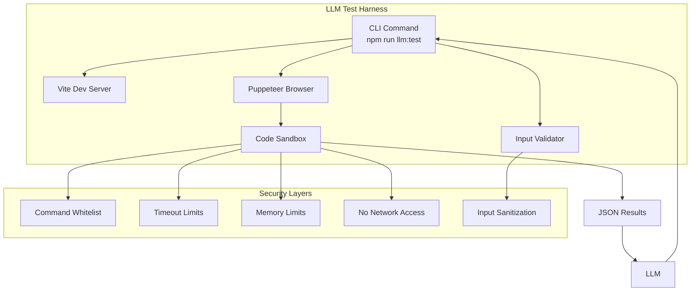

# LLM Testing Harness for Mepto

## Overview
A secure, isolated testing environment that allows LLMs to test Mepto functionality by executing JavaScript in a browser console via Puppeteer.

## Architecture



## Single Command Design

The harness will use `concurrently` to run both Vite and Puppeteer in parallel:

```bash
# Single command that starts everything
npm run llm:test -- --code="$('.test').addClass('active')"
```

### Process Flow
1. Start Vite dev server (waits for ready signal)
2. Start Puppeteer and connect to Vite
3. Execute LLM-provided code in isolated page context
4. Return results as JSON
5. Cleanup both processes

## Security Measures

### 1. Input Sanitization
- Whitelist allowed Mepto/jQuery methods
- Block dangerous global functions (eval, Function constructor)
- Sanitize string inputs to prevent injection
- Maximum code length limit (e.g., 5000 characters)

### 2. Execution Sandbox
- Run in isolated browser context
- No access to `window.parent` or `window.opener`
- Disable `alert()`, `confirm()`, `prompt()`
- No file system access

### 3. Resource Limits
- Maximum execution time: 5 seconds
- Memory limit: 64MB
- DOM depth limit: 100 nodes
- Maximum iterations in loops

### 4. Forbidden Patterns
```javascript
// Blocked patterns:
- eval(…)
- new Function(…)
- setTimeout/setInterval with string
- XMLHttpRequest/fetch to external domains
- document.write(…)
- window.open(…)
- location.href manipulation
- Script tag injection
- Data exfiltration attempts
```

## Implementation Structure

```
tools/
└── llm-test-harness/
    ├── bin/
    │   └── mepto-test.js          # CLI entry point
    ├── src/
    │   ├── index.ts               # Main orchestrator
    │   ├── server.ts              # Vite server manager
    │   ├── runner.ts              # Puppeteer runner
    │   ├── validator.ts           # Input validation
    │   ├── sandbox.ts             # Code sandbox
    │   └── security/
    │       ├── sanitizer.ts       # Input sanitization
    │       ├── whitelist.ts       # Allowed methods
    │       └── blocker.ts         # Forbidden pattern detection
    ├── templates/
    │   ├── test-page.html         # Test page template
    │   └── console-bridge.js      # Communication bridge
    └── package.json
```

## CLI Interface

### Commands

```bash
# Run single test
mepto-test --code="$('.item').length"

# Run with HTML fixture
mepto-test --code="$('#test').text()" --html="<div id='test'>Hello</div>"

# Run with external file
mepto-test --file=./test-script.js

# Run multiple tests
mepto-test --batch=./tests.json

# Interactive mode (for LLMs)
mepto-test --interactive --port=3001
```

### Output Format

```json
{
  "success": true,
  "result": "test value",
  "console": [
    {"type": "log", "message": "debug info"},
    {"type": "error", "message": "error message"}
  ],
  "timing": {
    "start": "2024-01-01T00:00:00Z",
    "end": "2024-01-01T00:00:00.5Z",
    "duration": 500
  },
  "memory": {
    "used": "12MB",
    "limit": "64MB"
  }
}
```

## Installation

```bash
# Add to main package.json devDependencies
npm install --save-dev puppeteer concurrently @types/puppeteer
```

## Integration with Main Package

Add to root package.json scripts:
```json
{
  "scripts": {
    "llm:test": "concurrently \"npm run dev\" \"wait-on http://localhost:3000 && node tools/llm-test-harness/bin/mepto-test.js\"",
    "llm:test:headless": "node tools/llm-test-harness/bin/mepto-test.js --headless"
  }
}
```

## Usage Example for LLMs

```javascript
// LLM can execute this via the harness
const result = await runTest({
  code: `
    const $el = $('<div class="test">Hello</div>');
    $el.addClass('active');
    return $el.hasClass('active');
  `,
  expect: true
});
```

## Safety Implementation Details

### Whitelist Approach
```typescript
const ALLOWED_METHODS = [
  // Mepto/jQuery methods
  '$', 'mepto', 'Mepto',
  'addClass', 'removeClass', 'toggleClass', 'hasClass',
  'attr', 'prop', 'data', 'html', 'text', 'val',
  'css', 'width', 'height', 'offset',
  'append', 'prepend', 'after', 'before',
  'find', 'parent', 'children', 'siblings',
  'on', 'off', 'trigger',
  // Safe globals
  'console', 'Math', 'JSON', 'Date', 'Array', 'Object', 'String', 'Number'
];
```

### Code Transformation
```typescript
// Wrap code in safe context
const safeCode = `
  (function() {
    'use strict';
    ${sanitizedCode}
  })()
`;
```

## Error Handling

| Error Type | Response |
|------------|----------|
| Timeout | `{ success: false, error: "Execution timeout" }` |
| Syntax Error | `{ success: false, error: "Syntax error", details: "…" }` |
| Security Violation | `{ success: false, error: "Security violation", pattern: "…" }` |
| Runtime Error | `{ success: false, error: "Runtime error", stack: "…" }` |

## Next Steps

1. Create the directory structure
2. Implement the validator with security rules
3. Build the Puppeteer runner
4. Create the CLI interface
5. Add tests for the harness itself
6. Document the API for LLM integration
